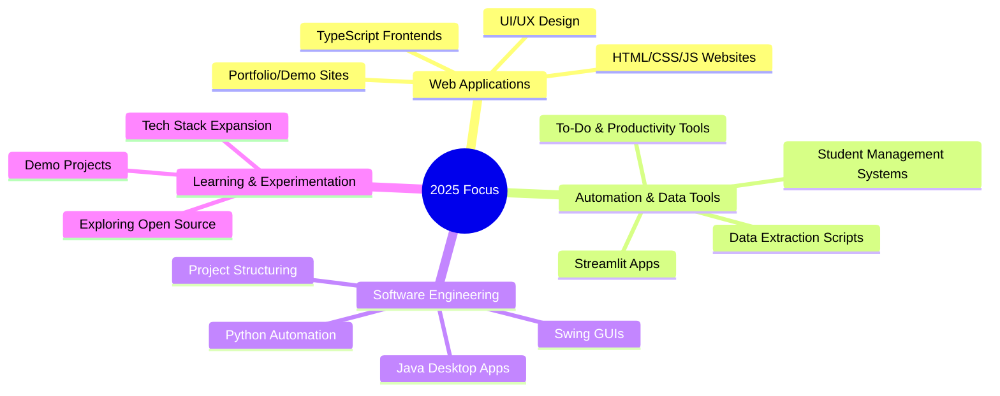

  <!-- Banner text and description updated for current focus -->
  

<!-- SOCIAL LINKS -->

  <!-- Replace LINK placeholders with your actual URLs -->
  
  
  
  
  

---

## 🚀 About Me

  

> **Delivering practical solutions in web, automation, and software development.**

Currently focusing on building user-friendly web applications, productivity tools, and automation scripts. My projects range from Java desktop apps (like StudentManagementGUI) and Python data tools (mcq_system, streamlit_mcq, DataPriceExtractor), to various HTML/CSS/TypeScript sites (WoodenCatalogue, wooden_doors, john-personal-portfolio-demo, todo-app).  
I'm passionate about leveraging simple but robust tech to solve everyday problems and streamline workflows.

**Current Focus:**  
- Empowering the next generation of software engineers through hands-on teaching and project-based learning  
- Practical software development with Java, Python, C++, C#, VB.NET, PHP, and modern web technologies (HTML5, CSS, JavaScript, TypeScript)  
- Rapid application development for web, desktop, and mobile platforms  
- Integrating database and cloud foundations (SQL Server, MySQL)  
- Building skills in mobile and game development with Android, Xamarin, Kotlin, and Swift  
- Advocating strong programming fundamentals, system design, and real-world problem solving

---

## 👨‍🏫 What I Teach

I teach practical, career-focused software engineering and application development, guiding learners from foundational programming to advanced, real-world projects.

 

 

I specialize in guiding beginners and aspiring professionals from basic programming concepts to advanced application and mobile development. My teaching blends theory and hands-on projects—covering everything from web and desktop software to mobile and game dev, databases, and rapid prototyping—preparing students for real-world roles in tech.

## 🛠️ Technical Toolkit

  
### Core Specializations

### Technology Stack

---

## 🎯 Domain Expertise

### 💻 Software & Web Development

*Websites • GUI Apps • Mobile & Game Apps • Rapid Application Development*

### ⚙️ Automation & Data Tools

*Data Extraction • Scripting • Databases • Interactive Dashboards*

### 🚀 Learning & Experimentation

*Trying New Tech • Sharing Knowledge • Exploring Open Source*

---

## 🌟 Featured Projects

### 🏢 StudentManagementGUI
A Java Swing application for managing student records. Features a user-friendly interface for CRUD operations, search, and record management.  
**Your Role:** Sole developer; designed and implemented the full Java desktop GUI.

---

### 🏢 mcq_system
A Python-based command-line MCQ (Multiple Choice Question) system for quizzes and tests.  
**Your Role:** Developed the core logic, CLI, and question/answer management.

---

### 🏢 WoodenCatalogue
A TypeScript project to catalogue wooden products, likely with a frontend interface for browsing and management.  
**Your Role:** Developed TypeScript components and basic UI.

---

### 🏢 DataPriceExtractor
A web tool that extracts data and prices from a Geonettech bundle page.  
**Your Role:** Built the HTML UI and implemented extraction logic.

---

### 🏢 streamlit_mcq
A Streamlit-based MCQ quiz app for interactive assessments in the browser.  
**Your Role:** Developed Streamlit interface and quiz logic.

---

### 🏢 todo-app
A simple Java-based To-Do application.  
**Your Role:** End-to-end development of the logic and UI.

---

## 🏆 Professional Certifications

<!-- Add your certifications below as available -->
<!-- Example:
- Microsoft Certified: Azure Fundamentals
- AWS Certified Solutions Architect - Associate
- Google Data Analytics Certificate
-->

<!-- Badges/links: -->

---

## 📊 GitHub Analytics

  

<table>
<tr>
<td align="center">
  
</td>
<td align="center">
  
</td>
<td align="center">
  
</td>
</tr>
</table>

---

### 🎯 Strategic Development Areas

